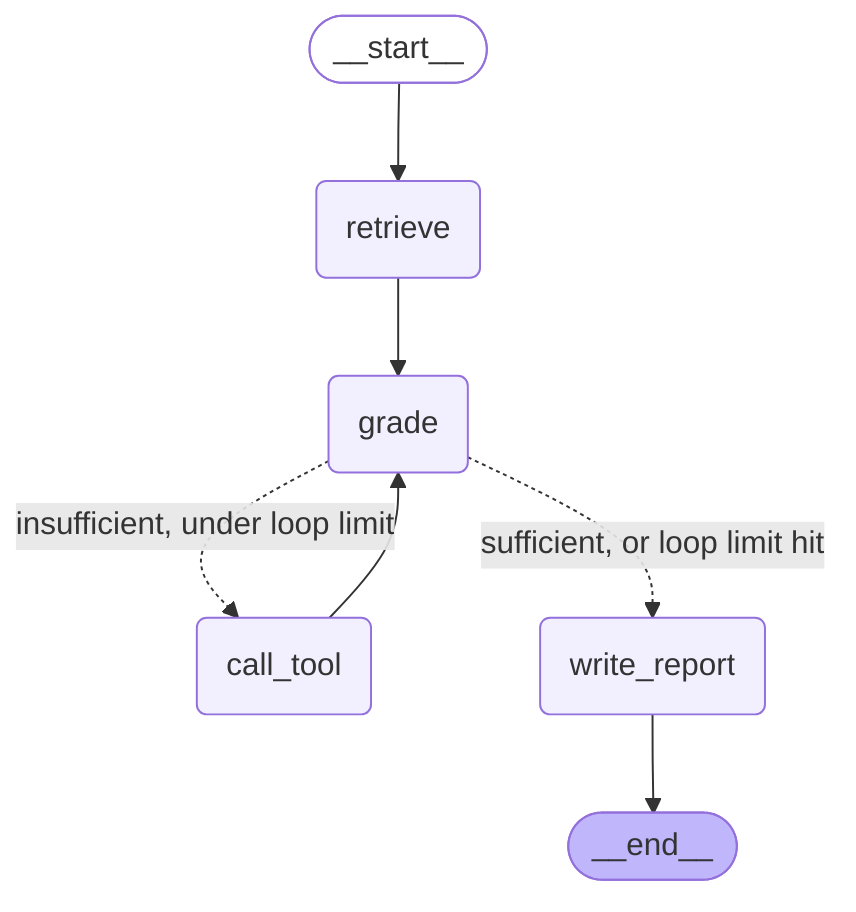

# LangGraph Report Agent

A LangGraph agent that retrieves from a Qdrant vector store, grades whether the retrieved
context is sufficient, calls a web-search or calculator tool when it isn't, and writes a
structured (Pydantic-validated) report. Includes a 12-question eval harness that scores
tool-use correctness and confidence calibration, not just "did it produce text."

Built with free tools only: Google Gemini (free API tier, used for grading/report-writing
only), Qdrant Cloud (free 1GB cluster), local embeddings + reranking via `fastembed`
(no API, no rate limit — runs on-device), and DuckDuckGo search (no API key required).

The chat UI supports attaching files directly in the message box (like ChatGPT) — `.txt`,
`.md`, `.pdf`, `.pptx`, and `.docx` are extracted, chunked, embedded, and added to the
Qdrant knowledge base immediately, so a newly uploaded doc is queryable in the same
conversation. Only the extracted text is kept locally (gzip-compressed under `uploads/`)
— not the original binary — since retrieval never touches the original file format.

## Architecture



- **retrieve**: embeds the question locally (`fastembed` / `BAAI/bge-small-en-v1.5`, ONNX,
  no API call), does a vector search against Qdrant for 15 candidates, then reranks them
  with a local cross-encoder (`Xenova/ms-marco-MiniLM-L-6-v2`) down to the top 4. Plain
  vector similarity alone tends to cluster everything in a narrow, hard-to-separate score
  band; the reranker gives a much more decisive signal (see below).
- **grade**: an LLM call that returns `{sufficient, reason, next_tool, tool_input}` as
  validated JSON — the "agent brain" deciding whether to answer now or gather more evidence.
- **call_tool**: runs `web_search` (DuckDuckGo, free) or `calculator` (a restricted AST
  evaluator — no `eval()`, since tool input comes from untrusted LLM output) and appends
  the result back into state, looping to `grade` again. Capped at 3 loops so a confused
  grader can't spin forever.
- **write_report**: writes a structured `Report` (title, summary, sections, sources,
  confidence) grounded only in what was retrieved/found.

## Retrieval quality: chunking + reranking, not just "call an embedding API"

Two changes replaced an earlier, weaker version of this pipeline:

- **Chunking**: naive fixed-width slicing (cutting text every 800 characters, mid-sentence)
  was replaced with `langchain-text-splitters`' `RecursiveCharacterTextSplitter` — it splits
  on paragraph breaks first, then sentences, then words, only falling back to a hard
  character cut as a last resort. 2026 chunking benchmarks (Vectara, Chroma) consistently
  find this beats fancier "semantic chunking" for the effort, at effectively zero extra cost.
- **Reranking**: an initial vector search pulls 15 candidates from Qdrant, then a local
  cross-encoder reranks them before the top 4 go to the LLM. Plain cosine similarity tends to
  score everything in a narrow band (e.g. 0.6–0.75) that's hard to distinguish; the reranker
  produces a decisive signal instead — asking "what access control roles does Aurora
  support?" scored the actually-relevant security doc at **+5.7** and the irrelevant pricing
  doc at **-6.4**, instead of both landing somewhere in "kind of similar."

Both the embedder (`BAAI/bge-small-en-v1.5`) and reranker (`Xenova/ms-marco-MiniLM-L-6-v2`)
run locally via `fastembed` (ONNX, CPU-only, no GPU needed) — a few hundred MB downloaded
once, then zero API calls and zero rate limits for retrieval, ever. Gemini is only called
for the grading and report-writing steps now.

## Failure mode handled: malformed structured output

Gemini's JSON output is reliable but not perfect — a truncated response, markdown fences
around the JSON, an extra field. Rather than trust it, [`llm.py`](src/agent/llm.py) validates
every structured response against its Pydantic schema and, on failure, retries exactly once
with the validation error fed back to the model. If that also fails, `write_report` catches
the resulting `StructuredOutputError` and returns a degraded-but-valid report (`confidence:
"low"`, raw context in place of synthesized content) instead of crashing the graph.

This same "don't fabricate" discipline shows up in the eval results below: asked for
Aurora's stock ticker (Aurora Cloud Storage is a fictitious product used for this demo),
the agent found an unrelated real company with a similar name via web search, and correctly
flagged low confidence rather than presenting it as a confirmed match.

## Eval results

12 questions across three categories — easy (answerable from the doc corpus alone), hard
(needs a tool call), and edge (no real answer exists, or the docs describe a nonexistent
product) — scored on tool-call correctness and confidence calibration, not exact-string
matching.

| ID | Category | Passed | Confidence | Tools Called | Loops |
|---|---|---|---|---|---|
| easy-1 | easy | PASS | high | none | 1 |
| easy-2 | easy | PASS | high | none | 1 |
| easy-3 | easy | PASS | high | none | 1 |
| easy-4 | easy | PASS | high | none | 1 |
| easy-5 | easy | PASS | high | none | 1 |
| hard-1 | hard | PASS | low | web_search | 2 |
| hard-2 | hard | PASS | high | web_search | 2 |
| hard-3 | hard | PASS | high | web_search | 2 |
| hard-4 | hard | FAIL | high | none | 1 |
| edge-1 | edge | PASS | low | web_search,web_search | 3 |
| edge-2 | edge | PASS | low | web_search,web_search | 3 |
| edge-3 | edge | PASS | low | web_search,web_search | 3 |

**11/12 passed.** The one failure (`hard-4`, a one-step multiplication) isn't a retrieval
regression: the model computed the correct dollar amount directly instead of invoking the
calculator tool, so the eval's *tool-use* check fails even though the *answer* was right.
That's a legitimate, honestly-reported miss against a strict grading criterion, not a bug
papered over — left as a FAIL rather than loosened to a pass.

Full detail (raw pass/fail reasoning per case) in
[`eval/results/results.md`](eval/results/results.md), regenerated each run.

Re-run it yourself: `python eval/run_eval.py`

## Project layout

```
src/agent/
  state.py        # shared graph state (TypedDict)
  schemas.py       # Pydantic contracts: GradeResult, Report
  nodes.py         # retrieve / grade / call_tool / write_report node functions
  graph.py         # StateGraph wiring + conditional edges
  llm.py           # Gemini chat model + structured-output retry-once helper
  retrieval/       # Qdrant client, embeddings, upsert/search/list_sources
  tools/           # calculator (AST-based, no eval()), web_search (DuckDuckGo)
  ingestion.py     # txt/md/pdf/pptx/docx -> extracted text -> chunks -> Qdrant
  app.py           # FastAPI: POST /ask
streamlit_app.py   # chat UI: ask questions, attach files to grow the knowledge base
scripts/ingest_docs.py  # bulk-ingest everything already in docs/
uploads/           # gzip-compressed extracted text from chat uploads (gitignored)
eval/
  questions.json   # 12 test questions (easy/hard/edge)
  run_eval.py      # scores tool-use + confidence, writes results.csv/.md
tests/             # pytest — mocks the LLM/network, no live API calls in CI
```

## Setup

1. **Python 3.11+** and a virtualenv:
   ```bash
   python -m venv .venv
   .venv\Scripts\pip install -e ".[dev]"
   ```

2. **Gemini API key** (free): get one at [aistudio.google.com/apikey](https://aistudio.google.com/apikey).

3. **Qdrant**: either a free [Qdrant Cloud](https://cloud.qdrant.io) cluster, or run locally
   with `docker compose up -d` (uses the included `docker-compose.yml`) — either works with
   the same code, only the `.env` values change.

4. Copy `.env.example` to `.env` and fill in `GEMINI_API_KEY`, `QDRANT_URL`, and
   `QDRANT_API_KEY` (omit the API key for a local Docker instance).

5. Ingest the sample corpus:
   ```bash
   python scripts/ingest_docs.py
   ```
   First run downloads the local embedding + reranking models (~350MB total, one-time,
   cached under your home directory) — no API key needed for this part.

## Running it

- **Chat UI**: `streamlit run streamlit_app.py`
- **API**: `uvicorn agent.app:app --reload` then `POST /ask {"question": "..."}`
- **Tests**: `pytest`
- **Eval**: `python eval/run_eval.py`

## A note on free-tier limits

Gemini's free tier rate-limits per model. This project defaults to `gemini-flash-lite-latest`
specifically because it has a much higher free daily quota than `gemini-flash-latest` — an
earlier version used the latter and hit `429 RESOURCE_EXHAUSTED` after ~10 questions. Both
`streamlit_app.py` and `app.py` catch upstream failures and surface a readable error instead
of crashing, since hitting a free-tier ceiling is an expected failure mode here, not an edge
case to ignore.

Embeddings and reranking used to go through Gemini's embedding API too, which has its own
(much stricter) free-tier quota — heavy testing in one session was enough to exhaust it, since
every retrieval and every file upload needed an API round-trip. Moving both to local `fastembed`
models removed that failure mode for retrieval entirely: Gemini is now only in the loop for
grading and report-writing, which is a small fraction of the calls a busy session makes.
