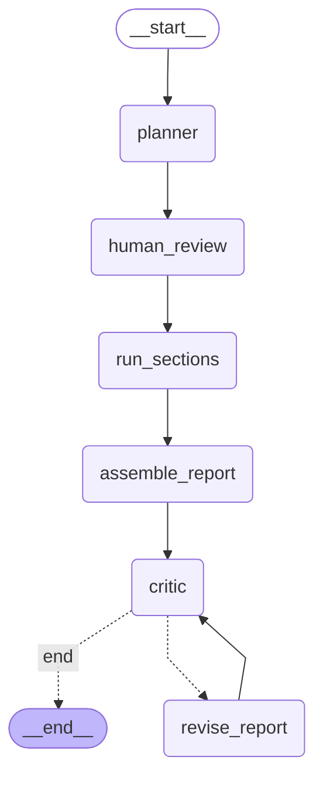
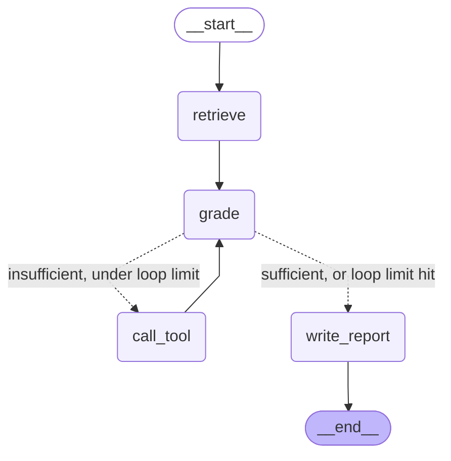

# ResearchGraph — Self-Evaluating Multi-Agent Research System

A LangGraph system that turns a topic into a multi-section research report: a planner breaks
it into sections, each section is independently retrieved/graded/researched, an evidence
verifier checks every section's claims trace back to real evidence, a self-critic reviews the
assembled report holistically, and an optional human-in-the-loop checkpoint lets a person edit
the outline before any section spends an LLM call.

This started as, and still contains, a single-question retrieval agent — ask one question, get
one grounded, structured answer. That agent didn't get replaced; it became the **per-section
subgraph** the research pipeline calls once per planned section, and it's still directly usable
on its own (chat UI, `POST /ask`). Nothing about the original build (local embeddings +
reranking, structured-output validation, tool-calling, the eval-harness philosophy of scoring
real behavior) was thrown away — the sections below cover both layers.

Built with free tools only: Google Gemini (free API tier, used for grading/planning/writing/
verifying/critiquing — never for embeddings), Qdrant Cloud (free 1GB cluster), local embeddings
+ reranking via `fastembed` (no API, no rate limit — runs on-device), and DuckDuckGo search (no
API key required).

## The research pipeline


```mermaid
---
config:
  flowchart:
    curve: linear
---
graph TD;
	__start__([<p>__start__</p>]):::first
	planner(planner)
	run_sections(run_sections)
	assemble_report(assemble_report)
	critic(critic)
	revise_report(revise_report)
	human_review(human_review)
	__end__([<p>__end__</p>]):::last
	__start__ --> planner;
	assemble_report --> critic;
	critic -. &nbsp;end&nbsp; .-> __end__;
	critic -.-> revise_report;
	human_review --> run_sections;
	planner --> human_review;
	revise_report --> critic;
	run_sections --> assemble_report;
	classDef default fill:#f2f0ff,line-height:1.2
	classDef first fill-opacity:0
	classDef last fill:#bfb6fc
```

*(Generated directly from `build_research_graph(enable_hitl=True).get_graph().draw_mermaid()`
— the unlabeled `critic -.-> revise_report` edge is the rejection path; LangGraph only labels
one branch of a conditional edge in this version. `human_review` is optional — `build_research_graph(enable_hitl=True)` wires it in; the
default, used by scripts and the eval harness, skips straight from `planner` to `run_sections`
since there's no human available to satisfy an approval pause there.)*

- **planner**: one structured-output call breaks the topic into 3-5 sections, each with a
  short title and a specific, self-contained sub-question.
- **human_review** *(optional)*: pauses via LangGraph's `interrupt()` primitive, surfacing the
  proposed outline so a human can remove or add sections before any section spends an LLM call
  — real pause/persist/resume via a checkpointer, not a fake sleep loop. See
  [Human-in-the-loop](#human-in-the-loop) below.
- **run_sections**: runs the single-question subgraph (below) once per planned section, then
  runs the Evidence Verifier on each section's output. Sequential by default; see
  [Research memory](#research-memory-and-the-parallel-path) for what this shares across
  sections and the (untested) parallel path.
- **assemble_report**: combines the per-section reports into one `Report`, computing
  report-wide evidence coverage and per-source confidence.
- **critic**: one call on the *assembled* report — catches what per-section verification
  structurally can't: repetition across sections, thin coverage of a planned section,
  contradictions. Rejects with specific issues, or accepts.
- **revise_report**: rewrites the report to address the critic's issues, constrained to
  evidence already collected across every section (no new facts invented) — bounded to one
  attempt, then whatever the critic's last verdict was stands.

### The per-section subgraph (the original single-question agent)


```mermaid
---
config:
  flowchart:
    curve: linear
---
graph TD;
	__start__([<p>__start__</p>]):::first
	retrieve(retrieve)
	grade(grade)
	call_tool(call_tool)
	write_report(write_report)
	__end__([<p>__end__</p>]):::last
	__start__ --> retrieve;
	call_tool --> grade;
	grade -.->|insufficient, under loop limit| call_tool;
	grade -.->|sufficient, or loop limit hit| write_report;
	retrieve --> grade;
	write_report --> __end__;
	classDef default fill:#f2f0ff,line-height:1.2
	classDef first fill-opacity:0
	classDef last fill:#bfb6fc
```

- **retrieve**: embeds the question locally (`fastembed` / `BAAI/bge-small-en-v1.5`, ONNX, no
  API call), vector-searches Qdrant for 15 candidates, merges in anything already retrieved for
  another section this run (research memory, below), then reranks the combined pool with a
  local cross-encoder (`Xenova/ms-marco-MiniLM-L-6-v2`) down to the top 4.
- **grade**: an LLM call returning `{sufficient, reason, next_tool, tool_input}` — decides
  whether to answer now or gather more evidence.
- **call_tool**: runs `web_search` (DuckDuckGo, free) or `calculator` (a restricted AST
  evaluator, no `eval()`) and loops back to `grade`. Capped at 3 loops.
- **write_report**: writes a structured `Report` grounded only in what was retrieved/found.

Every node appends a line to `state["trace"]` — retrieval scores, the grading verdict and
reason, tool calls, confidence — rendered as an expandable "Agent steps" panel in the UI and
included in the API response. Not a black box at either layer.

## Research memory, and the parallel path

Sections share a **research memory**: a run-scoped pool of every chunk retrieved so far, keyed
by chunk id. Each section's retrieval merges this pool into its fresh candidates before
reranking, so two sections don't independently cite the same underlying chunk as if it were two
different sources, and a section whose need is already covered can settle faster.

Sections run **sequentially by default**, matching this project's real constraint: Gemini's
free tier, not embedding cost (embeddings are local and free — the "share evidence to avoid
re-embedding" framing doesn't apply here; the actual saving is fewer *grading/writing* calls,
plus consistency across sections). `run_sections()` in `nodes.py` also accepts a `max_workers`
parameter that fans sections out across threads instead — **that path is real and functional,
but has not been load-tested against the free tier**, which won't survive real concurrent calls
long enough to verify it honestly. Architected, not battle-tested; said plainly rather than
implied.

## Evidence verification: per-source confidence and coverage, not a black-box score

Each section is checked by an **Evidence Verifier** — one Gemini call asking whether every
factual claim in the section traces back to its retrieved evidence. A section with unsupported
claims is regenerated once (bounded), with the specific unsupported claims fed back so the
retry doesn't repeat them; whatever the retry produces is used, honestly labeled either way.

The reranker already computes a relevance score per retrieved chunk — this project didn't
previously surface it past internal ranking. It now does, **sigmoid-normalized** into `[0,1]`
and explicitly labeled a *normalized reranker score*, not a calibrated probability: raw
cross-encoder scores run roughly -10 to +7 in testing (unbounded), and this corpus/model
combination skews heavily negative — even a spot-on correct citation can show ~5-30%
"confidence" after normalization. Presenting that as calibrated precision would undercut the
exact thing this project is supposed to demonstrate, so the field is documented as a heuristic
signal throughout (schema, UI, eval report). Sources with no reranker score (a web citation) get
a fixed, documented baseline instead of a fabricated number.

"Evidence coverage" is `supported claims / total claims`, computed per section and aggregated
report-wide (claim-weighted, not a plain average across sections) directly from what the
Verifier already found.

## Self-critic: catching what per-section checks structurally can't

Verifying each section in isolation can't catch a whole-report problem — two sections that
individually cite their evidence perfectly but both make the same point. A separate node
reviews the *assembled* report holistically for repetition, thin/missing coverage of a planned
section, and contradictions between sections; a rejected report gets one bounded revision pass.

This isn't hypothetical — a real run caught it: the critic flagged that "Professional Career
History" and "Key Projects" both duplicated the same project bullet points, `revise_report`
separated the concerns, and the re-critique accepted the result. Unscripted, not staged for
this README.

## Human-in-the-loop

`build_research_graph(enable_hitl=True)` inserts a real pause after planning, before any
section spends an LLM call, using LangGraph's `interrupt()`/`Command` primitives with a
checkpointer (`InMemorySaver` by default) — not a polling loop. The proposed outline surfaces
to the caller; resuming with an edited section list continues the run from exactly where it
paused.

- **CLI**: `python scripts/research_hitl_demo.py "your topic"` — pauses, prints the outline,
  accepts a comma-separated list of section numbers to keep (or Enter to accept as-is), resumes.
- **Streamlit**: check "🔬 Research mode" in the sidebar — submitting a topic pauses with an
  editable checklist (remove sections, optionally add one), and "Continue research" resumes.

Off by default (`build_research_graph()`, no arguments) — scripts and the eval harness have no
human available to satisfy an approval pause, and forcing one there would just hang.

**A real deprecation caught by actually running this, not by reading changelogs:** the default
checkpoint serializer warns when deserializing custom types (this project's Pydantic schemas)
from a checkpoint, and will block it in a future LangGraph version. Fixed by passing an explicit
`allowed_msgpack_modules` allowlist to the checkpointer (`graph.py`) — found only because the
CLI demo was actually run and its warning output actually read.

## Retrieval quality: chunking + reranking, not just "call an embedding API"

Two changes replaced an earlier, weaker version of this pipeline:

- **Chunking**: naive fixed-width slicing (cutting text every 800 characters, mid-sentence)
  was replaced with `langchain-text-splitters`' `RecursiveCharacterTextSplitter` — it splits
  on paragraph breaks first, then sentences, then words, only falling back to a hard
  character cut as a last resort. 2026 chunking benchmarks (Vectara, Chroma) consistently
  find this beats fancier "semantic chunking" for the effort, at effectively zero extra cost.
- **Reranking**: an initial vector search pulls 15 candidates from Qdrant, then a local
  cross-encoder reranks them before the top 4 go to the LLM. Plain cosine similarity tends to
  score everything in a narrow band (e.g. 0.6–0.75) that's hard to distinguish; the reranker
  produces a decisive signal instead — asking "what access control roles does Aurora
  support?" scored the actually-relevant security doc at **+5.7** and the irrelevant pricing
  doc at **-6.4**, instead of both landing somewhere in "kind of similar."

Both the embedder (`BAAI/bge-small-en-v1.5`) and reranker (`Xenova/ms-marco-MiniLM-L-6-v2`)
run locally via `fastembed` (ONNX, CPU-only, no GPU needed) — a few hundred MB downloaded
once, then zero API calls and zero rate limits for retrieval, ever. Gemini is only called
for the grading, planning, verification, critique, and report-writing steps.

## Local embedding is unlimited, but not instant — two ingestion paths

Trading Gemini's rate-limited embedding API for a local CPU model removes the quota ceiling,
but introduces a real one: CPU-only embedding is roughly **linear in total text volume**,
independent of chunk size (measured on an 8-core/16-thread Ryzen 7 laptop: ~0.175ms per
character, whether that's chunked into 500 pieces or 5,000 — multiprocessing across cores
only bought ~25%, not a multiple of core count, since fastembed's ONNX threading doesn't
scale the way you'd hope for batches this size). A genuinely large document — a few
million characters — takes single-digit minutes no matter how it's sliced.

So there are two paths, matching two different situations:

- **Chat upload** (attach a file in `streamlit_app.py`): capped at `MAX_CHUNKS_INTERACTIVE`
  (500 chunks, ~1-3 minutes worst case) so one huge file can't block an interactive session
  for 15+ minutes. A live progress bar with an ETA shows what's happening; if the file is
  bigger than the cap, the UI says so explicitly rather than silently dropping content.
- **Batch ingestion** (`python scripts/ingest_docs.py` on files in `docs/`): no cap
  (`max_chunks=None`) — appropriate for a one-time terminal command you can let run for as
  long as it needs, unlike a chat message someone is actively waiting on.

If you need a large document *fully* indexed, use the batch path. Uploading it through chat
will index its first ~500 chunks and tell you it did so.

## Failure mode handled: malformed structured output

Gemini's JSON output is reliable but not perfect — a truncated response, markdown fences
around the JSON, an extra field. Rather than trust it, [`llm.py`](src/agent/llm.py) validates
every structured response against its Pydantic schema and, on failure, retries exactly once
with the validation error fed back to the model. If that also fails, the calling node returns a
degraded-but-valid result (e.g. `confidence: "low"`, raw context in place of synthesized
content, or a section reported as unverifiable) instead of crashing the graph. This shows up
routinely in real runs — the grading call fails to produce valid JSON roughly once every few
sections in practice, and the pipeline just defaults to insufficient and moves on rather than
crashing.

This same "don't fabricate" discipline shows up in both eval results below: asked about
Aurora's stock ticker or a real person who happens to share a name with someone unrelated, the
agent found a similarly-named but unconfirmed match via web search and correctly flagged low
confidence rather than presenting it as verified.

## Eval results

Two separate harnesses, because a multi-section report needs different dimensions than "did it
call the right tool":

### Single-question eval (`eval/run_eval.py`)

12 questions across three categories — easy (answerable from the doc corpus alone), hard
(needs a tool call), and edge (no real answer exists, or the docs describe a nonexistent
product) — scored on tool-call correctness and confidence calibration, not exact-string
matching.

| ID | Category | Passed | Confidence | Tools Called | Loops |
|---|---|---|---|---|---|
| easy-1 | easy | PASS | high | none | 1 |
| easy-2 | easy | PASS | high | none | 1 |
| easy-3 | easy | PASS | high | none | 1 |
| easy-4 | easy | PASS | high | none | 1 |
| easy-5 | easy | PASS | high | none | 1 |
| hard-1 | hard | PASS | low | web_search | 2 |
| hard-2 | hard | PASS | high | web_search | 2 |
| hard-3 | hard | PASS | high | web_search | 2 |
| hard-4 | hard | FAIL | high | none | 1 |
| edge-1 | edge | PASS | low | web_search,web_search | 3 |
| edge-2 | edge | PASS | low | web_search,web_search | 3 |
| edge-3 | edge | PASS | low | web_search,web_search | 3 |

**11/12 passed.** The one failure (`hard-4`, a one-step multiplication) isn't a retrieval
regression: the model computed the correct dollar amount directly instead of invoking the
calculator tool, so the eval's *tool-use* check fails even though the *answer* was right —
left as a FAIL rather than loosened to a pass.

Full detail in [`eval/results/results.md`](eval/results/results.md), regenerated each run.
Re-run: `python eval/run_eval.py`

### Research eval (`eval/run_research_eval.py`)

2 topics grounded in the same fictional Aurora Cloud Storage docs (controlled ground truth),
scored on keyword coverage (did the report actually surface the known facts), section
completeness (did every planned section get written, including after any critic revision),
citation coverage (from the Evidence Verifier), and a retrieval-precision proxy (fraction of
retrieved chunks the reranker itself scored above a confidence threshold — a heuristic against
the reranker's own judgment, not a hand-labeled relevance dataset, since none exists for this
project). Kept small on purpose: one research topic costs 15-30+ Gemini calls, against a free
tier already established as the binding constraint on this whole project.

| ID | Passed | Confidence | Critic | Keyword Cov. | Section Cov. | Citation Cov. | Retrieval Prec. | Latency |
|---|---|---|---|---|---|---|---|---|
| aurora-overview | PASS | high | True | 80% | 100% | 96% | 62% | 99.6s |
| aurora-enterprise-buyer | PASS | low | True | 100% | 100% | 100% | 40% | 108.5s |

**2/2 passed.** The `enterprise-buyer` topic landed on **low** confidence despite passing every
threshold — a real instance of the entity-confusion trap this project already knew about
(`aurora_*.md` describes a fictional storage product; web search surfaced real, unrelated
companies/products also named "Aurora"), and the system correctly hedged rather than presenting
an unconfirmed match as fact. A passing eval score and a low-confidence report aren't
contradictory here — that's the intended behavior.

Full detail in [`eval/results/research_results.md`](eval/results/research_results.md),
regenerated each run. Re-run: `python eval/run_research_eval.py`

## Project layout

```
src/agent/
  state.py         # shared graph state: AgentState (single-question) + ResearchState (topic)
  schemas.py       # Pydantic contracts: GradeResult, Report, Plan, VerificationResult, CriticResult
  nodes.py         # retrieve/grade/call_tool/write_report + planner/human_review/run_sections/
                    #   verify_section/assemble_report/critic/revise_report
  graph.py         # build_graph() (single-question) + build_research_graph() (topic pipeline)
  llm.py           # Gemini chat model + structured-output retry-once helper
  retrieval/       # Qdrant client, embeddings, upsert/search (+ cross-section candidate merge)
  tools/           # calculator (AST-based, no eval()), web_search (DuckDuckGo)
  ingestion.py     # txt/md/pdf/pptx/docx -> extracted text -> chunks -> Qdrant
  app.py           # FastAPI: POST /ask (single-question)
  observability.py # optional Langfuse tracing, no-ops if LANGFUSE_PUBLIC_KEY isn't set
streamlit_app.py   # chat UI: single-question mode, or "Research mode" (multi-section + HITL)
scripts/
  ingest_docs.py         # bulk-ingest everything already in docs/
  prefetch_models.py     # bakes embedding/reranker models into the Docker image at build time
  research_demo.py       # CLI: topic in, multi-section report out (no HITL)
  research_hitl_demo.py  # CLI: same, but pauses for outline approval/edit first
Dockerfile.api          # FastAPI service container
Dockerfile.streamlit    # Streamlit UI container
render.yaml             # Render Blueprint: provisions both services, secrets via dashboard
uploads/           # gzip-compressed extracted text from chat uploads (gitignored)
eval/
  questions.json         # 12 single-question test cases (easy/hard/edge)
  run_eval.py            # scores tool-use + confidence, writes results.csv/.md
  research_topics.json   # 2 research-topic test cases (Aurora docs, controlled ground truth)
  run_research_eval.py   # scores keyword/section/citation coverage + retrieval precision + latency
tests/             # pytest — mocks the LLM/network, no live API calls needed
.github/workflows/ci.yml  # runs ruff + pytest on every push/PR
```

## Setup

1. **Python 3.11+** and a virtualenv:
   ```bash
   python -m venv .venv
   .venv\Scripts\pip install -e ".[dev]"
   ```

2. **Gemini API key** (free): get one at [aistudio.google.com/apikey](https://aistudio.google.com/apikey).

3. **Qdrant**: either a free [Qdrant Cloud](https://cloud.qdrant.io) cluster, or run locally
   with `docker compose up -d` (uses the included `docker-compose.yml`) — either works with
   the same code, only the `.env` values change.

4. Copy `.env.example` to `.env` and fill in `GEMINI_API_KEY`, `QDRANT_URL`, and
   `QDRANT_API_KEY` (omit the API key for a local Docker instance).

5. Ingest the sample corpus:
   ```bash
   python scripts/ingest_docs.py
   ```
   First run downloads the local embedding + reranking models (~350MB total, one-time,
   cached under your home directory) — no API key needed for this part.

## Running it

- **Chat UI**: `streamlit run streamlit_app.py` — toggle "🔬 Research mode" in the sidebar for
  the multi-section pipeline with editable-outline review; leave it off for the original
  single-question agent.
- **API**: `uvicorn agent.app:app --reload` then `POST /ask {"question": "..."}` (single-question)
- **Research CLI**: `python scripts/research_demo.py "your topic"` (no pause) or
  `python scripts/research_hitl_demo.py "your topic"` (pauses for outline review)
- **Tests**: `pytest`
- **Evals**: `python eval/run_eval.py` (single-question) and
  `python eval/run_research_eval.py` (research pipeline)

## Deployment: two Docker services on Render, tracing via Langfuse

The API and UI are deployed as **two separate services**, not one — they scale independently,
and the API can be demoed alone (`curl`/Postman) without spinning up the whole chat interface.
Both are plain Docker containers (`Dockerfile.api`, `Dockerfile.streamlit`), provisioned
together from [`render.yaml`](render.yaml) as a Render Blueprint.

**Why Render**: free tier requires no credit card, unlike GCP Cloud Run, Fly.io, or Railway,
all of which gate free usage behind a card on file — this account was never asked for one
(2026-09-13). Worth being precise about that claim: Render's own support forum documents cases
where its anti-fraud system card-gates specific accounts even on the free plan, so "no card"
isn't a guarantee for every account, just what actually happened here. 750 free instance-hours/
month, 15-minute spin-down when idle, real Docker support rather than a stripped-down runtime.

**Why the models are baked into the image at build time**
(`scripts/prefetch_models.py`, run during `docker build`): without this, the first request
after every cold start would pay a ~350MB download on top of loading the models into memory.
Baking them in at build time removes the *download* penalty; loading the models into memory on
a fresh start still has a real cost — measured, not guessed, on a local Docker container (build
already baked in, `docker run` to first successful request):

- Container boot to `/health` responding: **2.2s**
- Embedding + reranker model load into memory (already on disk, no download): **~0.4s** total
  (0.2s each) — this is the specific cost pre-baking couldn't eliminate
- First real `/ask` request end-to-end, simple question: **4.9s** (includes the model load above,
  plus a genuine Qdrant round-trip and two Gemini API calls — normal pipeline latency, not
  cold-start-specific)

These are local-container numbers, not a production Render measurement — actual Render cold
start will differ by whatever its own container-boot and network-path overhead adds on top.
Worth re-measuring once actually deployed there rather than assuming the local number transfers.
The research pipeline is not yet deployed to Render — only the single-question API/UI have been
containerized and measured; the multi-section pipeline currently runs locally/via CLI only.

**Secrets**: never in the image or the repo. `render.yaml` declares each secret with
`sync: false`, which tells Render to prompt for the actual value in its dashboard instead of
reading it from the file — `GEMINI_API_KEY`, `QDRANT_API_KEY`, `QDRANT_URL`, and the Langfuse
keys below are all handled this way.

**Observability**: [`agent/observability.py`](src/agent/observability.py) wires in
[Langfuse](https://langfuse.com) tracing (free tier, no card, 50K traces/month) across every
invocation site (API, UI, both eval harnesses) — request-level visibility into every LLM call,
retrieval, and tool call, tagged with `source` (`api`/`streamlit`/`eval`/`research_eval`) so
runs can be filtered by which surface produced them. Unlike LangSmith, Langfuse's LangChain/
LangGraph integration isn't purely env-var driven — it needs an explicit callback handler passed
to `.invoke()`, which is what `get_invoke_config()` builds. It's a graceful no-op (returns `{}`)
when `LANGFUSE_PUBLIC_KEY` isn't set, so local dev and tests never need a Langfuse account.
This is separate from and complementary to the custom `state["trace"]` logging above — the
trace panel shows *what the agent decided and why* in the UI itself; Langfuse shows *the raw
request/token/latency data* in a dashboard, useful for debugging across many runs at once.

```bash
# add to .env / Render secrets to enable tracing (optional -- omit to run without it)
LANGFUSE_PUBLIC_KEY=your-langfuse-public-key
LANGFUSE_SECRET_KEY=your-langfuse-secret-key
LANGFUSE_HOST=https://us.cloud.langfuse.com
```

## A note on free-tier limits

Gemini's free tier rate-limits per model. This project defaults to `gemini-flash-lite-latest`
specifically because it has a much higher free daily quota than `gemini-flash-latest` — an
earlier version used the latter and hit `429 RESOURCE_EXHAUSTED` after ~10 questions. A single
research topic now costs roughly 15-30 Gemini calls (planner + N sections × grade/tool/write/
verify + critic, plus any bounded retries), which is why the research eval harness deliberately
stays small and every long-running script sleeps between cases. Both `streamlit_app.py` and
`app.py` catch upstream failures and surface a readable error instead of crashing, since hitting
a free-tier ceiling is an expected failure mode here, not an edge case to ignore.

Embeddings and reranking used to go through Gemini's embedding API too, which has its own
(much stricter) free-tier quota — heavy testing in one session was enough to exhaust it, since
every retrieval and every file upload needed an API round-trip. Moving both to local `fastembed`
models removed that failure mode for retrieval entirely: Gemini is now only in the loop for the
LLM-reasoning steps (planning, grading, verifying, critiquing, writing), which is a small
fraction of the calls a busy session makes.

## Known limitations (worth saying out loud, not hiding)

- **Per-source confidence is a heuristic, not a calibrated probability.** Sigmoid-normalized
  reranker scores are bounded and directionally meaningful, but this corpus/model combination
  skews negative enough that even correct citations can show low numbers. Documented everywhere
  the field appears rather than presented as more precise than it is.
- **Retrieval precision in the eval harness is a proxy**, measured against the reranker's own
  confidence threshold, not a hand-labeled relevant/irrelevant ground truth (none exists for
  this project).
- **The parallel section-execution path is architected but not load-tested** — free-tier Gemini
  won't survive real concurrent calls long enough to verify it honestly, so it isn't claimed as
  proven.
- **Entity confusion is a known, recurring failure mode**, not fully solved: a topic or question
  whose subject shares a name with something else (a real company sharing a name with the
  fictional "Aurora" product; a real, unrelated person sharing a name with whoever a report is
  about) can pull in web results about the wrong entity. The system's mitigation is graded
  honesty (defaulting to low confidence when it can't confirm a match), not prevention — it
  still surfaces the mismatch in the sources rather than always catching it before writing.
- **The research pipeline (planner/verifier/critic/HITL) is not yet containerized or deployed**
  — only the original single-question agent has measured Docker/Render numbers.
